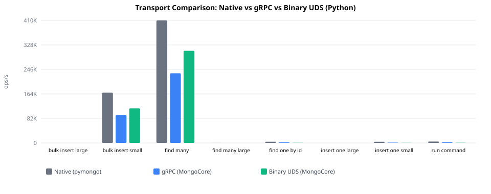
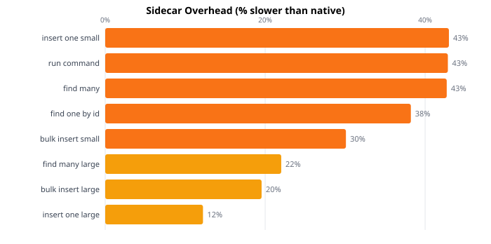
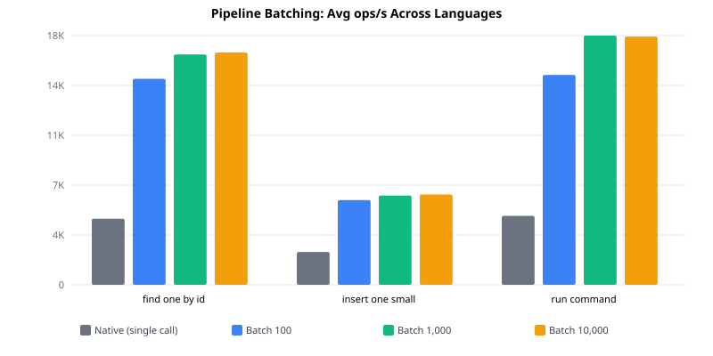
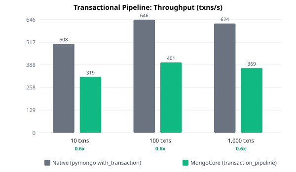

# Benchmark Results

Generated: 2026-05-22 13:47 UTC

## Driver Operations

### Python

| Operation | Native | gRPC | Binary | gRPC % | Binary % |
|-----------|-------:|-----:|-------:|-------:|---------:|
| bulk_insert_large | 51 | 31 | 34 | -39% | -33% |
| bulk_insert_small | 168.4K | 93.7K | 115.9K | -44% | -31% |
| find_many | 410.5K | 233.5K | 308.7K | -43% | -25% |
| find_many_large | 58 | 45 | 40 | -22% | -32% |
| find_one_by_id | 4027 | 2173 | 492 | -46% | -88% |
| insert_one_large | 41 | 36 | 34 | -14% | -17% |
| insert_one_small | 3884 | 1134 | 286 | -71% | -93% |
| run_command | 4668 | 2382 | 518 | -49% | -89% |

### Typescript

| Operation | Native | gRPC | Binary | gRPC % | Binary % |
|-----------|-------:|-----:|-------:|-------:|---------:|
| bulk_insert_large | 42 | 35 | — | -16% | — |
| bulk_insert_small | 185.8K | 88.8K | — | -52% | — |
| find_many | 275.6K | 164.6K | — | -40% | — |
| find_many_large | 48 | 37 | — | -23% | — |
| find_one_by_id | 4001 | 2711 | — | -32% | — |
| insert_one_large | 42 | 36 | — | -15% | — |
| insert_one_small | 1677 | 1247 | — | -26% | — |
| run_command | 4390 | 2651 | — | -40% | — |

### Go

| Operation | Native | gRPC | Binary | gRPC % | Binary % |
|-----------|-------:|-----:|-------:|-------:|---------:|
| bulk_insert_large | 43 | 37 | — | -13% | — |
| bulk_insert_small | 138.2K | 142.7K | — | +3% | — |
| find_many | 222.6K | 157.3K | — | -29% | — |
| find_many_large | 56 | 45 | — | -20% | — |
| find_one_by_id | 5568 | 3289 | — | -41% | — |
| insert_one_large | 42 | 36 | — | -13% | — |
| insert_one_small | 1879 | 1471 | — | -22% | — |
| run_command | 5668 | 3522 | — | -38% | — |

### Java

| Operation | Native | gRPC | Binary | gRPC % | Binary % |
|-----------|-------:|-----:|-------:|-------:|---------:|
| bulk_insert_large | 30 | 30 | — | -2% | — |
| bulk_insert_small | 131.9K | 111.1K | — | -16% | — |
| find_many | 353.9K | 167.9K | — | -53% | — |
| find_many_large | 57 | 44 | — | -23% | — |
| find_one_by_id | 5101 | 3378 | — | -34% | — |
| insert_one_large | 29 | 28 | — | -6% | — |
| insert_one_small | 1848 | 1445 | — | -22% | — |
| run_command | 4784 | 2596 | — | -46% | — |

**Native:** Driver connects directly to MongoDB. 
**gRPC:** Operations routed through the MongoCore sidecar via gRPC/HTTP2. 
**Binary:** Operations routed through the MongoCore sidecar via binary UDS protocol. 
**% columns:** Compared to Native — negative means slower, positive means faster.

## Pipeline Batching

| Operation | Batch Size | Python | TypeScript | Go | Java | Fastest Native | vs Native |
|-----------|----------:|-------:|-----------:|---:|-----:|---------------:|----------:|
| find_one_by_id | 100 | 14.9K | 12.8K | 16.0K | 14.6K | 5568 | +162% |
| find_one_by_id | 1000 | 16.5K | 14.5K | 17.2K | 16.9K | 5568 | +193% |
| find_one_by_id | 10000 | 16.2K | 14.9K | 17.4K | 17.2K | 5568 | +195% |
| insert_one_small | 100 | 5993 | 5934 | 6185 | 5850 | 3884 | +54% |
| insert_one_small | 1000 | 6164 | 6220 | 6417 | 6438 | 3884 | +62% |
| insert_one_small | 10000 | 6190 | 6350 | 6513 | 6510 | 3884 | +65% |
| run_command | 100 | 16.1K | 13.8K | 17.2K | 12.3K | 5668 | +162% |
| run_command | 1000 | 17.8K | 15.5K | 18.7K | 18.5K | 5668 | +211% |
| run_command | 10000 | 17.6K | 16.2K | 18.0K | 18.3K | 5668 | +210% |

**Native:** Each operation is a separate round-trip to MongoDB (10,000 individual calls per iteration). 
**MongoCore:** N operations batched into a single gRPC call (e.g. batch 1000 = 10 calls of 1000 ops each). 
**What this shows:** The benefit of reducing round-trips — even with sidecar overhead, batching multiple operations into fewer network calls is significantly faster than individual calls.

## Transactional Pipeline

| Batch Size | Native (txns/s) | MongoCore (txns/s) | vs Native |
|-----------:|----------------:|-------------------:|----------:|
| 10 | 508 | 319 | -37% |
| 100 | 646 | 401 | -38% |
| 1,000 | 624 | 369 | -41% |

**Pattern:** 3-operation transfer (find_one + update debit + update credit) across 1,000 accounts. 
**Native:** pymongo `session.with_transaction()` — 3 sequential round-trips per transaction plus session management. 
**MongoCore:** Single `transaction_pipeline()` gRPC call per transaction with result forwarding (`{{lookup_source._id}}`) — server handles session lifecycle and executes all steps internally. 
**What this shows:** On localhost, both drivers make the same 3 round-trips to MongoDB — but pymongo talks directly while MongoCore adds a gRPC hop plus reference resolution overhead. The transactional pipeline's advantage emerges over real networks where reducing client↔DB round-trips matters (e.g., cloud deployments with cross-AZ latency). On localhost this benchmark isolates the raw sidecar cost for atomic multi-step workflows.

## Ingestion

| Scenario | Format | Size | Native (MB/s) | gRPC Polars (MB/s) | Binary Bulk (MB/s) | vs Native |
|----------|--------|-----:|--------------:|-------------------:|-------------------:|----------:|
| ingest | csv | 10k | 10.90 | 9.18 | 7.91 | -16% |
| ingest | ndjson | 10k | — | — | — | — |
| ingest | csv | 100k | — | — | — | — |
| ingest | ndjson | 100k | — | — | — | — |
| ingest | csv | 500k | — | — | — | — |
| ingest | ndjson | 500k | — | — | — | — |
| ingest + transform | csv | 10k | 12.73 | 16.05 | — | +26% |
| ingest + transform | ndjson | 10k | — | — | — | — |
| ingest + transform | csv | 100k | — | — | — | — |
| ingest + transform | ndjson | 100k | — | — | — | — |
| ingest + transform | csv | 500k | — | — | — | — |
| ingest + transform | ndjson | 500k | — | — | — | — |

**Native:** Read file from disk, parse with Python's csv/json stdlib, apply transforms in a per-row loop, batch insert with 4 concurrent threads (pymongo). 
**MongoCore:** Single gRPC call triggers Polars (Rust) to read, parse, and apply vectorized transforms, then write with 4 concurrent async tasks. 
**What this shows:** At scale, Polars' columnar processing and Rust-native I/O outperform Python's per-row parsing and transformation — the gap widens with row count.

## Environment

- **OS:**  ()
- **CPUs:** 
- **MongoCore:** 
